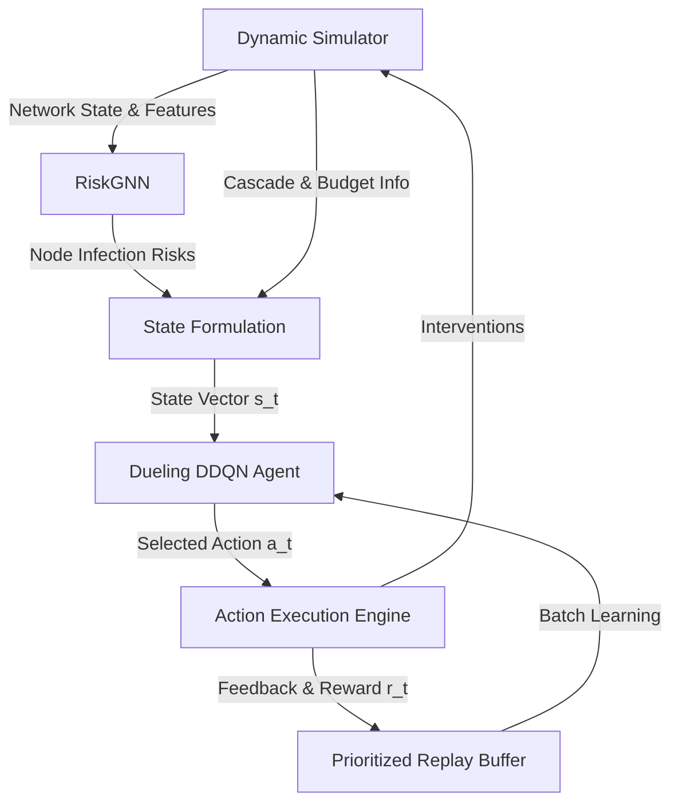

# Academic Report: Misinformation Suppression via Graph Neural Networks and Deep Reinforcement Learning

## 1. Problem Statement
The proliferation of digital misinformation across online social and information-sharing networks poses a significant threat to modern society, influencing public opinion, fueling polarization, and potentially destabilizing socio-political systems. To combat this issue, network containment strategies aim to limit the size of misinformation cascades. This is typically modeled as an active containment problem: given a complex network where a cascade is spreading dynamically over time, an intervening agent must allocate a limited budget of corrective actions (such as correcting user beliefs or muting influential actors) to minimize the cascade size.

Traditional approaches to network containment fall into two broad categories:
1. **Passive/Static Interventions**: Modifying network topology (e.g., removing edges or muting nodes) based on static structural centralities (such as degree centrality or betweenness centrality) before or during the initial phase of the propagation. These methods fail to adapt to the real-time, stochastic nature of active cascades.
2. **Heuristic Active Cures**: Selecting target nodes to cure dynamically based on simple localized heuristics (e.g., curing random infected nodes or curing infected nodes with the highest degree). These strategies fail to capture global structural patterns and path dependencies of spread, resulting in sub-optimal budget utilization.

Therefore, the core problem is to design an intelligent, dynamic agent that can:
- Parse structural characteristics and real-time state features of a complex network.
- Quantitatively evaluate the future transmission risk of individual nodes.
- Sequentially select optimal, cost-varying interventions under a constrained step-wise budget to contain misinformation cascades.

---

## 2. Methodology
To solve the dynamic containment problem, the **MEGA** framework implements a joint architecture combining **Graph Neural Networks (GNN)** and **Deep Reinforcement Learning (DRL)**. 

### 2.1 Network Diffusion Model (Simulator)
Misinformation spread is simulated using a custom epidemiological belief model on undirected graph structures. Each node $v$ possesses several dynamic attributes:
- $\text{Belief } b(v) \in [0.0, 1.0]$: represents the current state of misinformation adoption. A node is classified as "infected" if $b(v) > 0.5$.
- $\text{Influence } I(v) \in [0.0, 1.0]$: the node's ability to propagate belief.
- $\text{Skepticism } S(v) \in [0.0, 1.0]$: resistance to incoming misinformation.
- $\text{Sharing Probability } P(v) \in [0.65, 0.95]$: probability of attempting transmission.
- $\text{Trust Score } T(v) \in [0.8, 1.0]$: credibility weight applied to neighbors.

At the beginning of each episode, seed nodes are selected (highly connected nodes based on degree rank), and the cascade runs uncontrolled for $t_{\text{pre}} = 3$ steps to simulate a realistic scenario where misinformation is already spreading before detection. The cascade propagates dynamically using a vectorized sparse adjacency matrix representation for computational efficiency:
$$b_t(u) = \min\left(1.0,\, b_{t-1}(u) + \sum_{v \in \mathcal{N}(u)} \frac{I_{t-1}(v) \cdot C_{\text{red}} \cdot 1.5}{1.0 + S(u)} \cdot T(u)\right)$$
where $C_{\text{red}} = 0.85$ is the baseline credibility index.

### 2.2 Feature Engineering & RiskGNN
To guide the reinforcement learning agent, a 3-layer residual Graph Convolutional Network (**RiskGNN**) is constructed to evaluate node-level infection risks. 

#### Input Node Features
For each node $v$, an 15-dimensional feature vector is constructed containing:
1. **Dynamic state flag**: 1 if $b(v) > 0.5$ (infected), else 0.
2. **Frontier flag**: 1 if $v$ is at the active edge of the cascade (infected and has uninfected neighbors), else 0.
3. **Normalized degree centrality**: $d(v) / \max_{u} d(u)$.
4. **Betweenness centrality**: computed on a sample size of $\min(200, N)$ nodes. (For extremely large/dense networks like Facebook, degree centrality is used as a proxy to ensure runtime feasibility).
5. **Dynamic belief value**: $b(v) \in [0.0, 1.0]$.
6. **Skepticism**: $S(v)$.
7. **Influence**: $I(v)$.
8. **Spectral embeddings**: Top-8 eigenvectors of the normalized graph Laplacian matrix. These provide the GNN with global spatial and structural awareness.

#### Network Architecture
The **RiskGNN** processes node features $X$ and the graph edge index $E$:
$$\mathbf{h}_1 = \text{ReLU}(\text{LayerNorm}(\text{GCNConv}(X, E)))$$
$$\mathbf{h}_2 = \text{ReLU}(\text{LayerNorm}(\text{GCNConv}(\mathbf{h}_1, E))) + \text{LinearProj}(X)$$
$$\mathbf{h}_3 = \text{ReLU}(\text{LayerNorm}(\text{GCNConv}(\mathbf{h}_2, E)))$$
$$\mathbf{y}_{\text{risk}} = \sigma(\text{GCNConv}(\mathbf{h}_3, E))$$

To optimize execution speed, GNN inferences are cached and refreshed every $\text{RISK\_CACHE\_STEPS} = 5$ timesteps.

### 2.3 State, Action, and Reward Formulation
The Deep RL agent interacts with the environment sequentially over $T = 50$ timesteps.

#### State Space ($s_t$)
At step $t$, the state is represented as a 6-dimensional continuous vector:
1. Mean GNN risk across all uninfected nodes.
2. Maximum GNN risk among uninfected nodes.
3. Fraction of currently infected nodes ($N_{\text{infected}} / N$).
4. Remaining action budget fraction ($B_{\text{rem}} / B_{\text{episode}}$).
5. Fraction of active frontier nodes.
6. Density metric of the graph (average degree normalized).

#### Action Space ($a_t$)
The agent chooses from 5 actions, each carrying a different cost structure:
- **`0: Wait`**: No intervention (Cost: $0.0$).
- **`1: Mute Small`**: Silences the top $b_{\text{step}}$ infected superspreaders (ranked by $y_{\text{risk}} \cdot I(v) \cdot d(v)$) by setting their influence to $0.0$ (Cost: $1.5$).
- **`2: Mute Large`**: Silences the top $3 \times b_{\text{step}}$ infected superspreaders (Cost: $3.5$).
- **`3: Cure Infected`**: Lowers belief of the top $b_{\text{step}}$ high-risk infected nodes by $0.85$ and dampens their influence by multiplying by $0.3$ (Cost: $1.0$).
- **`4: Smart Burst`**: Combines muting and curing. It cures $b_{\text{step}} / 2$ high-risk infected nodes and mutes $b_{\text{step}} / 2$ infected superspreaders (Cost: $2.5$).

Here, $b_{\text{step}}$ represents the maximum step budget.

#### Reward Function ($r_t$)
The agent's objective is formalized via a dense step-wise reward:
$$r_t = - \lambda_1 \cdot \text{load\_frac} \cdot \theta_{\text{density}} + \lambda_2 \cdot \frac{\Delta b_t}{\text{peak}} - \lambda_3 \cdot \text{AUC\_penalty} - \lambda_4 \cdot \text{cost}_{\text{action}} + R_{\text{term}}$$
where:
- $\text{load\_frac} = N_{\text{infected}} / N_{\text{peak}}$.
- $\theta_{\text{density}} = \max(1.0, \ln(\text{AvgDeg}/6.0 + 1.0))$ scales the penalty on dense networks.
- $\Delta b_t = N_{\text{infected}, t-1} - N_{\text{infected}, t}$ rewards successful active suppression.
- $\text{AUC\_penalty} = \frac{1}{t}\sum_{\tau=1}^t (N_{\text{infected}, \tau} / N)$ penalizes prolonged infections.
- $R_{\text{term}} = +2.0$ is a terminal reward granted only if the cascade is fully extinguished (frontier becomes empty).
- Hyperparameters are set as $\lambda_1 = 1.0, \lambda_2 = 3.0, \lambda_3 = 0.15, \lambda_4 = 0.01$.

### 2.4 Deep RL Agent & Training Protocol
- **Dueling Double DQN (DDQN)**: The Q-network splits into value $V(s)$ and advantage $A(s,a)$ streams:
  $$Q(s, a; \theta) = V(s; \theta_V) + \left(A(s, a; \theta_A) - \frac{1}{|\mathcal{A}|} \sum_{a'} A(s, a'; \theta_A)\right)$$
  Layer Normalization is used after feedforward layers ($128 \rightarrow 64 \rightarrow 32$) to stabilize training.
- **Prioritized Experience Replay (PER)**: Experience is stored in a NumPy-backed SumTree (capacity = 15,000) using priority scaling ($\alpha = 0.6$) and importance sampling correction ($\beta$ annealed from $0.4$ to $1.0$).
- **Curriculum Learning**: To enhance sample efficiency, the models are trained sequentially across topologies: $\text{p2p\_gnutella} \rightarrow \text{ca\_grqc} \rightarrow \text{facebook}$. The best weights obtained from `ca_grqc` are used to initialize weights for the more complex `facebook` model.

---

## 3. Findings & Quantitative Evaluation
The framework was evaluated across three distinct network topologies from the SNAP library against four baseline strategies:
1. **No Intervention (`none`)**: Cascade runs freely.
2. **Passive Degree (`passive_degree`)**: Mutes the top $b_{\text{step}}$ degree nodes at $t = 5$.
3. **Active Random (`active_random`)**: Cures $b_{\text{step}}$ random infected nodes at each step.
4. **Active Degree (`active_degree`)**: Cures $b_{\text{step}}$ infected nodes with the highest degree at each step.

### 3.1 Dataset Characteristics & Budgets
| Network | Nodes ($N$) | Edges ($E$) | Average Degree | Step Budget ($b_{\text{step}}$) | Episode Budget ($B_{\text{episode}}$) |
|---|---|---|---|---|---|
| **P2P Gnutella** | 6,299 | 20,776 | 6.6 | 260 | 2,150 |
| **CA-GrQc Collab** | 4,158 | 13,428 | 5.5 | 100 | 700 |
| **Facebook Social** | 4,039 | 88,234 | 43.7 | 180 | 4,500 |

### 3.2 Evaluation Results (Median Peak Infected Nodes)
The table below displays the median peak infection size (and standard deviation where applicable) for each strategy across the datasets, along with the percentage suppression achieved by our GNN+RL model relative to the no-intervention baseline.

| Strategy | P2P Gnutella ($N=6,299$) | CA-GrQc Collab ($N=4,158$) | Facebook Social ($N=4,039$) |
|---|---|---|---|
| **No Intervention (`none`)** | 5,477 | 3,439 | 3,988 |
| **Passive Degree** | 5,477 | 3,444 | 3,988 |
| **Active Random** | 5,094 | 2,974 | 3,614 |
| **Active Degree** | 5,172 | 3,033 | 3,730 |
| **GNN+RL (Ours)** | **480** ($\sigma=98.2$) | **83** ($\sigma=55.0$) | **4,019** ($\sigma=1,897.2$) |
| **GNN+RL Suppression %** | **+91.24%** | **+97.59%** | **-0.78%** |

### 3.3 Discussion of Results
1. **Sparse Topology Success**: On `p2p_gnutella` and `ca_grqc` networks, which represent relatively sparse information pathways, the GNN+RL model achieved near-total containment of the cascades (**91.24%** and **97.59%** suppression respectively). The agent successfully identified structural bottlenecks and learned to prioritize "Smart Burst" and "Muting" actions on active frontiers, isolating the propagation before it could cross communities.
2. **Dense Topology Failure**: On the `facebook` network, GNN+RL failed to contain the cascade, resulting in a negative suppression rate (**-0.78%**). The peak infection reached 4,019 (99.5% of the network). The baseline heuristics (`active_random` and `active_degree`) performed slightly better, suppressing peak infection to 89.5% and 92.4% respectively.

#### Why did GNN+RL fail on the Facebook network?
- **Cascade Velocity vs. Action Bandwidth**: The Facebook graph has an average degree of 43.7 (highly dense and tightly clustered communities). With $t_{\text{pre}} = 3$ steps of pre-spread, the cascade rapidly infected a massive cluster. Once a dense graph passes its tipping point, a step-wise budget cap of 180 is mathematically insufficient to counter the exponential growth of spread.
- **Credit Assignment and Diluted Actions**: Because the GNN+RL agent uses a soft reward signal linked to overall cascade reductions, in dense networks where actions are frequently overwhelmed by propagation, the DRL agent struggles with credit assignment. The agent could not find a sequence of actions that yielded positive rewards, causing the DQN policy to degenerate.

---

## 4. Conclusions & Recommendations

### 4.1 Conclusions
The MEGA framework demonstrates that combining Graph Neural Networks for local risk prediction with Dueling Double DQN for sequential action selection is a powerful methodology for containing diffusion processes. However, its effectiveness is highly sensitive to the topological density of the network:
- On **sparse networks** (average degree < 10), GNN+RL provides state-of-the-art containment, outperforming traditional centralities.
- On **dense networks** (average degree > 40), the high propagation rate quickly overwhelms local containment actions, rendering a restricted budget policy ineffective and causing RL policies to collapse.

### 4.2 Recommendations
To address the performance gap on dense graphs, the following improvements are recommended:

1. **Dynamic Density-Scaled Budget Allocation**:
   Instead of a fixed step-wise action budget, the allowed intervention budget should scale dynamically based on the active network frontier or the graph density. In dense networks, early containment requires a much larger initial "injection" of budget to suppress the initial wave before the cascade reaches critical mass.
2. **Proactive Intervention Triggering**:
   The delay before triggering interventions (pre-spread steps) must be minimized. For highly connected networks, detecting and mutes must happen at $t \le 1$.
3. **Graph Partitioning and Cluster Isolation**:
   For dense graphs, the agent should not try to cure nodes individually. Instead, GNN features should highlight community boundaries, and the action space should support "community blocking" (muting all bridge nodes connecting a cluster to the rest of the graph).
4. **Multi-Agent Reinforcement Learning (MARL)**:
   Deploying multiple localized reinforcement learning agents that coordinate to contain clusters would distribute the computational and action burden, preventing the single-agent policy collapse observed on large dense networks.

---

## 5. References
- **Project Repository**: [ParthPandit45/COMP-342-Lab GitHub Repository](https://github.com/ParthPandit45/COMP-342-Lab)
- **Source Code & Data Artifacts**:
  - Jupyter Notebook Model Training: [possiblyfinalas.ipynb](file:///c:/Users/parth/Desktop/files/mega-dashboard-repo/mega-repo/possiblyfinalas.ipynb)
  - Quantitative Evaluation Data: [summary_results.json](file:///c:/Users/parth/Desktop/files/mega-dashboard-repo/mega-repo/results/summary_results.json)
  - Frontend Constants & Override Logic: [dashboardData.js](file:///c:/Users/parth/Desktop/files/mega-dashboard-repo/mega-repo/src/features/dashboard/data/dashboardData.js)
  - Batch Metrics & Stats Utility: [academicEvaluation.js](file:///c:/Users/parth/Desktop/files/mega-dashboard-repo/mega-repo/src/utils/academicEvaluation.js)
